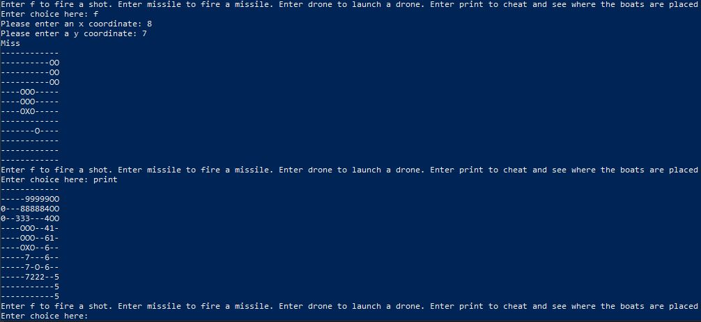
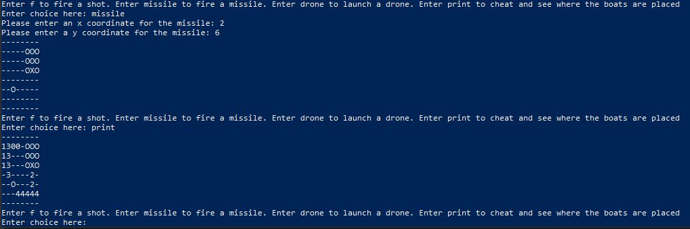

# Battleboats

This is **Battleboats**. It is a Battleships clone written in Java. 
- You can choose to play in either standard or expert mode where ships are randomly generated and placed on the boards. 
- It is your job to sink all of the ships in the least amount of turns and the least amount of shots possible. 
- BattleboatsBoard.java is used to generate the randomly placed boats on the appropriate sized board as well as store all of the functions such as the missile ability and the normal fire shot function. 
- BattleboatsGame.java is the actual game file. In order to play, you must compile both files and then run the BattleboatsGame file.
Enjoy!

**Above is a picture that shows the fire and print function in action on an expert sized board.**

**Above is a picture that shows the missile and print function in action on a standard sized board.**

**TODO:** 
- Refactor to reduce repetitive code
- Figure out a solution to input validation with non-int inputs when the user is prompted for locations to attack or scan
- Add in the ability to store all hits, misses, and special abilities in an SQL database
